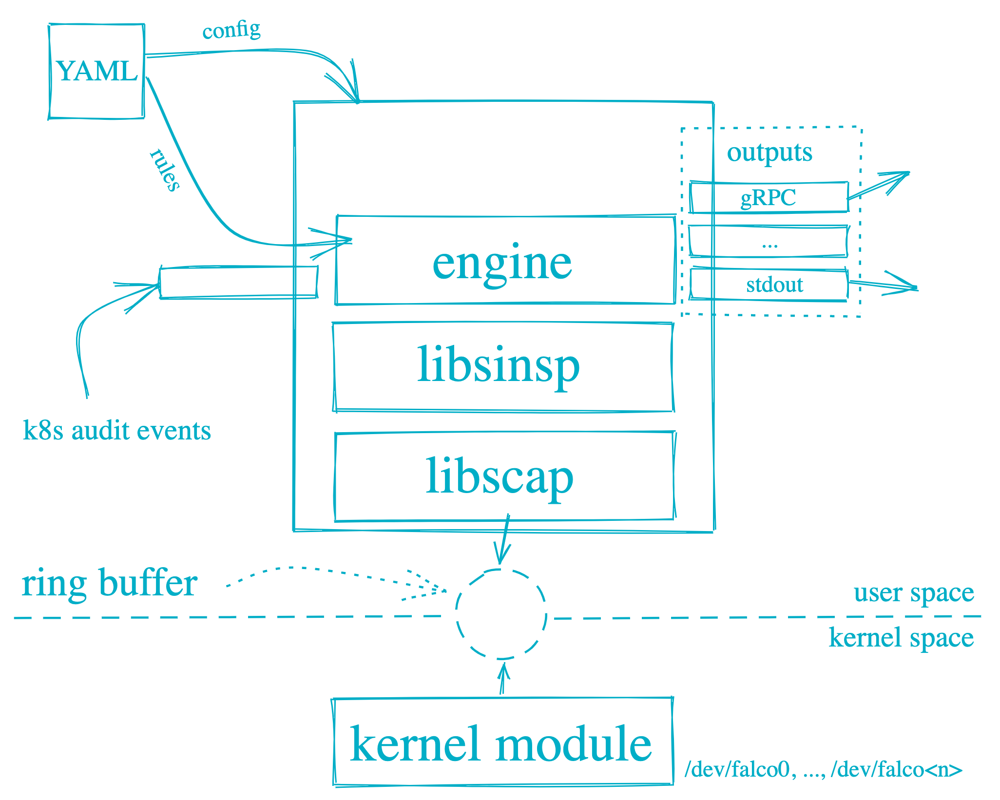

## falco 

falco 커널 모듈에 syscall이 먼저 전달 되고 falco는 policy엔진으로 해당 호출을 보내서 유저 영역에 있는 정책 룰을 통해 정해진 결과물을 출력한다.

### falco 설치
[공식 문서 링크](https://falco.org/docs/getting-started/installation/)

- 서비스로 설치하기 
- daemonset으로 설치

## falco로 위험감지하기
### falco rules
<table>
<tr>
<td> rule 설명 </td> <td> 예시 </td>
</tr>
<tr>
<td>

```yaml
  - rule: 룰 이름
    desc: 룰에 대한 설명 (description)
    condition: 이벤트를 필터링 하기 위한 조건
    output: 룰에 매칭되었을 경우 출력물
    priority: 이벤트에 대한 위험도
```

</td>
<td>

```yaml
- rule: change_thread_namespace
  desc: an attempt to change a program/thread\'s namespace (commonly done as a part of creating a container) by calling setns.
  condition: syscall.type = setns and not proc.name in (docker, sysdig, dragent)
  output: "Namespace change (setns) by unexpected program (user=%user.name command=%proc.cmdline container=%container.id)"
  priority: WARNING
```

</td>
</tr>
</table>


### falco rule - condition

🔥 주의 
같은 조건의 룰이 존재하는 경우 `/etc/falco/falco.yaml`의 룰 리스트 중 마지막 룰이 적용됨

#### 리스트 사용
위의 예시 중 `proc.name in (docker, sysdig, dragent)` 형식을 리스트 변수로 변경해보기

```yaml
- list: specific_process
  items: [docker, sysdic, dragent]
- rule: change_thread_namespace
  desc: an attempt to change a program/thread\'s namespace (commonly done as a part of creating a container) by calling setns.
  condition: syscall.type = setns and not proc.name in (specific_process)
  output: "Namespace change (setns) by unexpected program (user=%user.name command=%proc.cmdline container=%container.id)"
  priority: WARNING
```

#### 매크로 사용하기
매크로를 사용하면 좀 더 룰을 이해하기 쉬워진다. 

위의 예시 중 `syscall.type = setns` 형식을 매크로를 사용해 변경해보기

```yaml
- macro: set_namespace
  condition: syscall.type = setns
- rule: change_thread_namespace
  desc: an attempt to change a program/thread\'s namespace (commonly done as a part of creating a container) by calling setns.
  condition: set_namespace and not proc.name in (docker, sysdig, dragent)
  output: "Namespace change (setns) by unexpected program (user=%user.name command=%proc.cmdline container=%container.id)"
  priority: WARNING
```

## falco 설정 파일
falco는 `/etc/falco/falco.yaml` 경로에 설정 파일이 위치해있다.

해당 파일을 수정하는 경우 엔진을 재 시작해 주어야 한다.

```sh
# Hot Reloaded
cat /var/run/falco.pid
kill -1 $( cat /var/run/falco.pid )

# falco 재시작
systemctl restart falco
```

