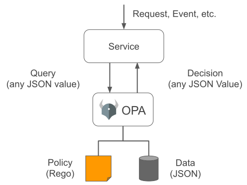

## 📋 OPA 

OPA의 정책을 이해하는 곳이라면 어디서든 OPA를 사용할 수 있다.

정책을 선언적으로 작성할 수 있는데 Rego라는 언어를 사용하여 정책을 작성한다.

### Rego 맛보기 
👅 [Rego 맛보기 사이트](https://play.openpolicyagent.org/) 에서 직접 룰을 작성해 볼 수 있다.
#### 변수 선언하기

변수 선언 방법 Basic

```rego
pi := 3.14159
rect := {"width": 2, "height": 4}
```

조건을 통한 변수 선언 방법
```rego
t if { x: = 42; y:=41; x > y} # true
# ; 대신 줄 바꿈을 사용할 수 있다.
t2 if {
    x := 42
    y := 41
    x > y
}
```

#### 정책 추가 하기  
```sh
curl -X PUT --data-binary @<regofile> http://localhost:8181/v1/policies/<policy name>
```

#### 로딩된 정책 확인하기 
```sh
curl http://localhost:8181/v1/policies
```

### OPA 동작 방법 설명


OPA를 이용하여 유저 정보를 확인하는 코드를 다음과 같이 변경할 수 있다. 

🖇️ 사용 된 정책 
```rego
package httpapi.authz

# HTTP Request 가져오기
import input

default allow = false

allow if {
    input.path == "home"
    input.user == "nueavv"
}
```

<table>
<tr><td> 변경 전 </td><td> 변경 후 </td></tr>
<tr>
<td>

```python
@app.route('/home')
    user = request.args.get("user")
    if user != "nueavv":
        return "Unauthorized!", 401
    return "Welcom!", 200
```

</td>
<td>

```python
@app.route('/home')
    user = request.args.get("user")
    
    input_dict = {
        "input": {
            "user": user,
            "path": "home",
        }
    }

    # OPA에 쿼리
    response = requests.post('http://127.0.0.1:8181/..authz/', json=input_dict)

    # 쿼리 결과가 허용 X 인경우
    if not response.json()["result"]["allow"]":
        return "Unauthorized!", 401
    return "Welcom!", 200
```

</td>
</tr>
</table>

### 쿠버네티스에 적용하기

OPA를 `validation webhook`과 `mutating webhook`의 백엔드로 연결하면 된다.


쿠버네티스는를 위한 rego 패키지가 있으며 다음과 같이 사용할 수 있다. 

```rego
package kubernetes.admission

deny[reason] {
  some container
  input_containers[container]
  not startswith(container.image, "hooli.com/")
  reason := "container image refers to illegal registry (must be hooli.com)"
}

input_containers[container] {
  container := input.request.object.spec.containers[_]
}

input_containers[container] {
  container := input.request.object.spec.template.spec.containers[_]
}
```

admission review를 통해서는 쿠버네티스 환경에 있는 다른 리소스들에 대한 정보는 알 수 없다.
그런데, 이미 존재하는 리소스들과 연관이 있는 정책을 만들어 내고 싶다면 어떻게 해야 할까?
(ex 다른 네임스페이스에 있는 서비스 객체와 동일한 이름의 서비스 객체는 생성되지 못하게 막기 )

이때 사용되는 것이 `kube-mgmt` 이다. 

#### 쿠버네티스에 정책 적용하기
위의 문제를 해결하기 위한 policy

```rego 
#duplicated-check.rego
package kubernetes.admission 

import data.kubernetes.services

deny[reason] {
    input.request.kind.kind == "Service"
    input_service_name := input.request.object.metadata.name
    other_service_names := services[other_ns][other_name].metadata.name
    input_service_name == other_service_names
    reason := sprintf("Servicename '%v' already exists!", [input_service_name])
}
```
위의 정책 파일을 컨피그맵으로 추가한다.
`openpolicyagent.org/policy=rego` 라벨을 붙여 배포하면 정책은 알아서 로딩된다.

```sh
kubectl create cm <컨피그맵 이름> --from-file duplicated-check.rego 
kubectl label cm <컨피그맵 이름> openpolicyagent.org/policy=rego
```

### OPA Gatekeeper
